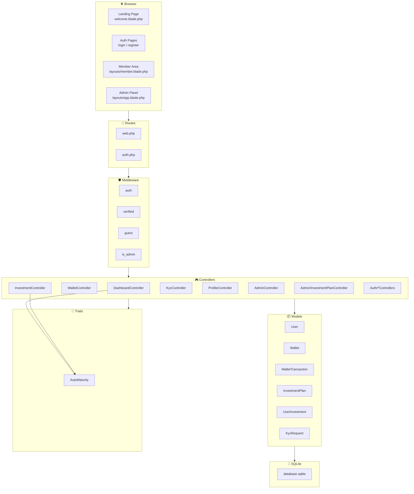
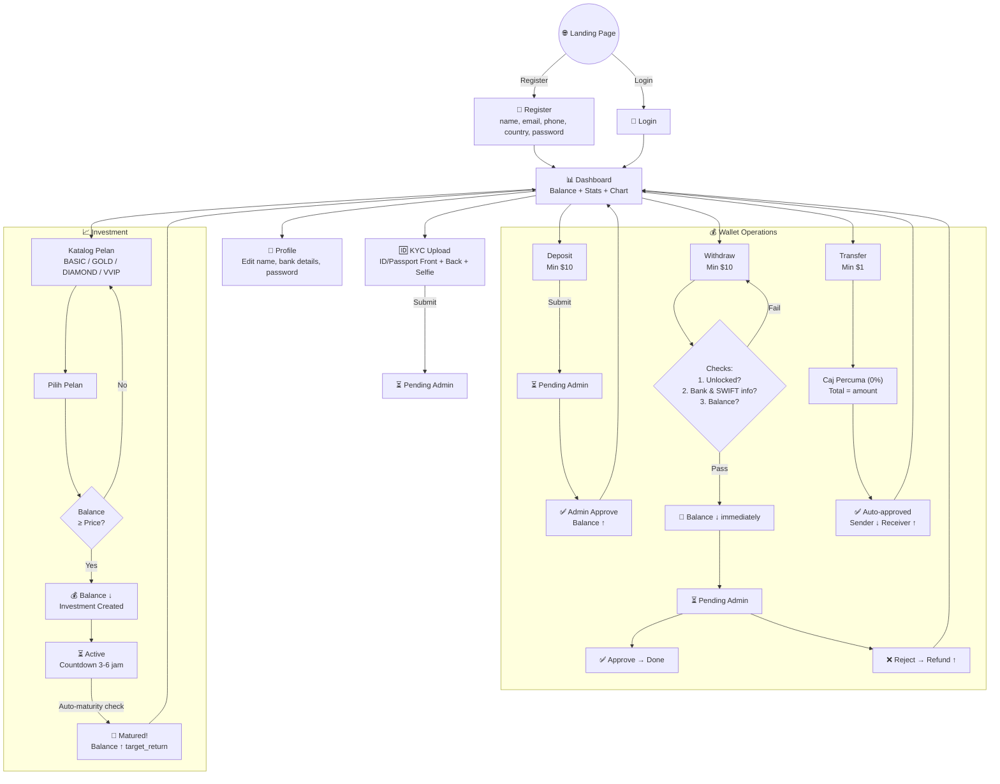
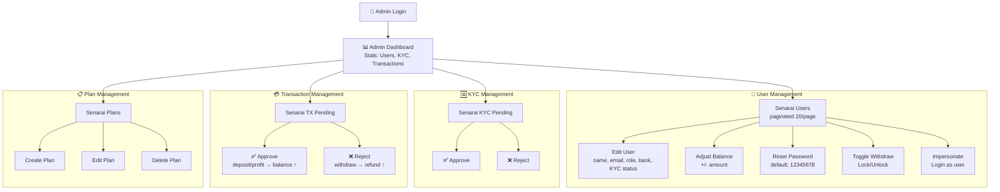

# 🏗️ DENAH PROJECT — Global Interactive Markets Investment Platform

> **Project Blueprint & Architecture Map (Global Version)**  
> Dokumen ini adalah peta lengkap struktur projek untuk rujukan agent pembinaan semula.

---

## 1. Peta Direktori Projek

```
Global Interactive Markets/
├── app/
│   ├── Http/
│   │   ├── Controllers/
│   │   │   ├── Admin/
│   │   │   │   └── InvestmentPlanController.php    ← CRUD pelan pelaburan (admin)
│   │   │   ├── Auth/                               ← Laravel Breeze auth controllers
│   │   │   │   ├── AuthenticatedSessionController.php
│   │   │   │   ├── ConfirmablePasswordController.php
│   │   │   │   ├── EmailVerificationNotificationController.php
│   │   │   │   ├── EmailVerificationPromptController.php
│   │   │   │   ├── NewPasswordController.php
│   │   │   │   ├── PasswordController.php
│   │   │   │   ├── PasswordResetLinkController.php
│   │   │   │   ├── RegisteredUserController.php    ← Custom: tambah phone, country, currency
│   │   │   │   └── VerifyEmailController.php
│   │   │   ├── Controller.php                      ← Base controller
│   │   │   ├── AdminController.php                 ← Admin: users, KYC, wallet, impersonate
│   │   │   ├── DashboardController.php             ← Dashboard + auto-maturity
│   │   │   ├── InvestmentController.php            ← Pelaburan user + auto-maturity
│   │   │   ├── KycController.php                   ← Upload KYC documents
│   │   │   ├── ProfileController.php               ← Edit profil user
│   │   │   └── WalletController.php                ← Deposit, Withdraw, Transfer
│   │   ├── Middleware/
│   │   │   └── IsAdmin.php                         ← Guard: role === 'admin'
│   │   └── Requests/
│   │       ├── Auth/                               ← Breeze request classes
│   │       └── ProfileUpdateRequest.php
│   ├── Models/
│   │   ├── User.php                                ← Relationships + maskedBankAccount accessor
│   │   ├── Wallet.php                              ← HasOne dari User
│   │   ├── WalletTransaction.php                   ← HasMany dari User
│   │   ├── InvestmentPlan.php                      ← HasMany UserInvestment
│   │   ├── UserInvestment.php                      ← BelongsTo User + InvestmentPlan
│   │   └── KycRequest.php                          ← HasOne dari User
│   ├── Providers/
│   ├── Traits/
│   │   └── AutoMaturity.php                        ← Auto-settle matured investments
│   └── View/
│       └── Components/                             ← Blade view components
│
├── database/
│   ├── migrations/
│   │   ├── 0001_01_01_000000_create_users_table.php
│   │   ├── 0001_01_01_000001_create_cache_table.php
│   │   ├── 0001_01_01_000002_create_jobs_table.php
│   │   ├── 2026_04_09_004052_create_wallets_table.php
│   │   ├── 2026_04_09_004053_create_wallet_transactions_table.php
│   │   ├── 2026_04_09_004054_create_kyc_requests_table.php
│   │   ├── 2026_04_09_004055_create_investment_plans_table.php
│   │   ├── 2026_04_09_004056_create_user_investments_table.php
│   │   ├── 2026_04_09_043800_add_withdraw_unlocked_to_users_table.php
│   │   └── 2026_04_12_073507_restructure_investment_plans_tables.php
│   ├── factories/
│   │   └── UserFactory.php
│   ├── seeders/
│   │   ├── DatabaseSeeder.php                      ← Admin account + sample plans
│   │   └── InvestmentPlanSeeder.php                ← 12 tiered investment plans in USD
│   └── database.sqlite
│
├── resources/
│   ├── css/
│   │   └── app.css                                 ← Vite entry (TailwindCSS)
│   ├── js/
│   │   └── app.js                                  ← Vite entry (Alpine.js, Axios)
│   └── views/
│       ├── welcome.blade.php                       ← Landing page (standalone)
│       ├── dashboard.blade.php                     ← User dashboard (extends member)
│       ├── layouts/
│       │   ├── app.blade.php                       ← Admin layout (Breeze default)
│       │   ├── guest.blade.php                     ← Auth pages layout
│       │   ├── member.blade.php                    ← Member area layout (bottom nav)
│       │   └── navigation.blade.php                ← Top navigation (Breeze)
│       ├── auth/
│       │   ├── login.blade.php
│       │   ├── register.blade.php                  ← Custom: tambah phone, country, currency
│       │   ├── forgot-password.blade.php
│       │   ├── reset-password.blade.php
│       │   ├── verify-email.blade.php
│       │   └── confirm-password.blade.php
│       ├── user/
│       │   ├── investment.blade.php                ← Katalog pelan pelaburan
│       │   ├── investment_active.blade.php         ← Senarai pelaburan aktif
│       │   ├── kyc.blade.php                       ← Upload KYC form
│       │   └── wallet/
│       │       ├── deposit.blade.php               ← Form deposit
│       │       ├── withdraw.blade.php              ← Form withdraw
│       │       └── transfer.blade.php              ← Form transfer
│       ├── admin/
│       │   ├── dashboard.blade.php                 ← Admin stats overview
│       │   ├── users.blade.php                     ← User list table
│       │   ├── users_edit.blade.php                ← Edit user form
│       │   ├── kyc.blade.php                       ← KYC pending list
│       │   ├── wallet.blade.php                    ← Pending transactions
│       │   └── plans/
│       │       ├── index.blade.php                 ← Plan list
│       │       ├── create.blade.php                ← Create plan form
│       │       └── edit.blade.php                  ← Edit plan form
│       ├── profile/
│       │   ├── edit.blade.php
│       │   └── partials/
│       ├── components/                             ← Reusable Blade components
│       │   ├── application-logo.blade.php
│       │   ├── auth-session-status.blade.php
│       │   ├── danger-button.blade.php
│       │   ├── dropdown.blade.php
│       │   ├── dropdown-link.blade.php
│       │   ├── input-error.blade.php
│       │   ├── input-label.blade.php
│       │   ├── modal.blade.php
│       │   ├── nav-link.blade.php
│       │   ├── primary-button.blade.php
│       │   ├── responsive-nav-link.blade.php
│       │   ├── secondary-button.blade.php
│       │   └── text-input.blade.php
│       └── partials/
│           └── animated-bg.blade.php               ← Background animation
│
├── routes/
│   ├── web.php                                     ← All web routes
│   ├── auth.php                                    ← Auth routes (Breeze)
│   └── console.php                                 ← Artisan commands
│
├── public/
│   ├── css/
│   │   └── design_tokens.css                       ← CSS custom properties / variables
│   ├── custom_ui.css                               ← Global UI overrides
│   ├── myasset/
│   │   ├── css/style.css                           ← Landing page styles
│   │   ├── image/
│   │   │   ├── main_logo.png                       ← Logo Global Interactive Markets
│   │   │   └── pc_main.svg                         ← Hero illustration
│   │   └── js/
│   ├── user/
│   │   ├── css/
│   │   │   ├── gmtd_member_v2.css                  ← Member area styles
│   │   │   └── sweetalert.css
│   │   └── js/
│   │       └── sweetalert-dev.js
│   ├── assets/vendor_components/
│   │   └── font-awesome/                           ← FA icons (local copy)
│   ├── logintheme/                                 ← Auth theme assets
│   ├── build/                                      ← Vite compiled assets
│   ├── index.php                                   ← Laravel entry point
│   └── .htaccess
│
├── config/                                         ← Laravel configs (standard)
│   └── ...
├── storage/                                        ← Logs, cache, uploaded files
├── tests/
├── composer.json
├── package.json
├── vite.config.js
├── tailwind.config.js
├── postcss.config.js
└── .env.example
```

---

## 2. Diagram Arsitektur

### 2.1 Arsitektur MVC



### 2.2 Entity Relationship Diagram (ERD)

```mermaid
erDiagram
    USERS ||--o| WALLETS : "hasOne"
    USERS ||--o{ WALLET_TRANSACTIONS : "hasMany"
    USERS ||--o| KYC_REQUESTS : "hasOne"
    USERS ||--o{ USER_INVESTMENTS : "hasMany"
    INVESTMENT_PLANS ||--o{ USER_INVESTMENTS : "hasMany"

    USERS {
        bigint id PK
        string name
        string email UK
        string password
        string phone
        string bank_name
        string bank_account
        string swift_code
        string bank_locked_at
        string status_kyc
        boolean is_disabled
        boolean is_withdraw_unlocked
        string country_code
        string country_name
        string currency_code
        string currency_symbol
        string role
    }

    WALLETS {
        bigint id PK
        bigint user_id FK
        string currency
        decimal balance
    }

    WALLET_TRANSACTIONS {
        bigint id PK
        bigint user_id FK
        string currency
        string type
        string status
        decimal amount
        string note
        string idempotency_key UK
    }

    KYC_REQUESTS {
        bigint id PK
        bigint user_id FK_UK
        string id_front_path
        string id_back_path
        string selfie_path
        string status
        string note
    }

    INVESTMENT_PLANS {
        bigint id PK
        string tier
        string name
        string description
        decimal price
        decimal target_return
        integer duration_days
        boolean status
        integer sort_order
    }

    USER_INVESTMENTS {
        bigint id PK
        bigint user_id FK
        bigint plan_id FK
        string plan_name
        decimal amount
        decimal target_return
        integer duration_days
        datetime start_at
        datetime end_at
        string status
    }
```

---

## 3. Flow Pengguna (User Journey)

### 3.1 Aliran Utama Pengguna



### 3.2 Aliran Admin



---

## 4. Peta Route Lengkap

Semua route dikekalkan sama dengan versi Malaysia tetapi dengan menggunakan penunjuk URL dan penamaan Global Interactive Markets. Sila rujuk [PRD_Global_Interactive_Markets.md](file:///e:/Global%20Interactive%20Markets/PRD_Global_Interactive_Markets.md) untuk perincian modul dan route.

---

## 5. Model Relationships Map

Sila rujuk diagram Mermaid di `DENAH_KWSP.md` Seksyen 5. Untuk model `User`, kita menambah fillable field `swift_code` untuk menampung transaksi bank antarabangsa.

---

## 6. Nota Pembinaan Semula (Global)

> [!IMPORTANT]
> **Langkah-langkah untuk membina semula projek Global Interactive Markets ini:**
> 1. Inisialisasi projek Laravel baru di workspace semasa.
> 2. Pasang Laravel Breeze (`composer require laravel/breeze --dev`) dan pasang scaffolding Blade.
> 3. Buat migration database yang diubahsuai (menyokong `swift_code`, lalai mata wang `USD`, baki `$`).
> 4. Bina model dengan relationship, middleware `IsAdmin`, dan trait `AutoMaturity`.
> 5. Implementasi Controllers dengan mesej & label dalam Bahasa Inggeris.
> 6. Salin dan ubahsuai Blade views untuk mempamerkan penjenamaan **Global Interactive Markets**.
> 7. Sediakan fail-fail CSS token warna bertema korporat (biru gelap & teal).
> 8. Daftarkan seeder dan mulakan pengujian aplikasi.
