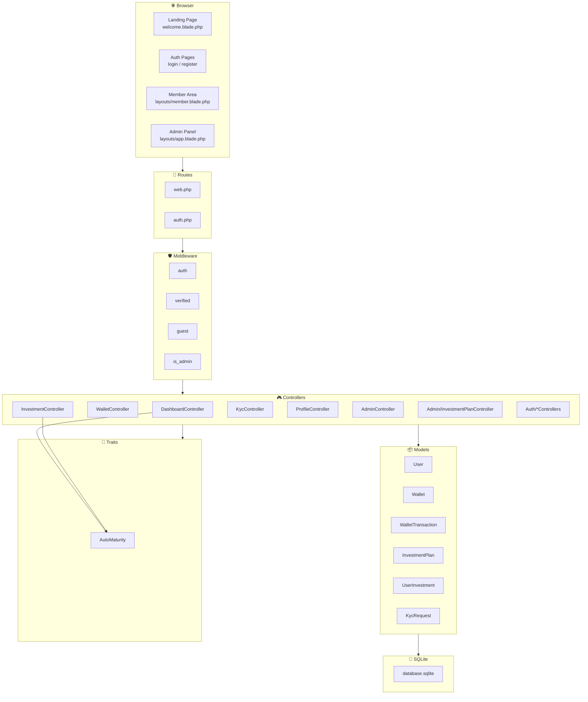
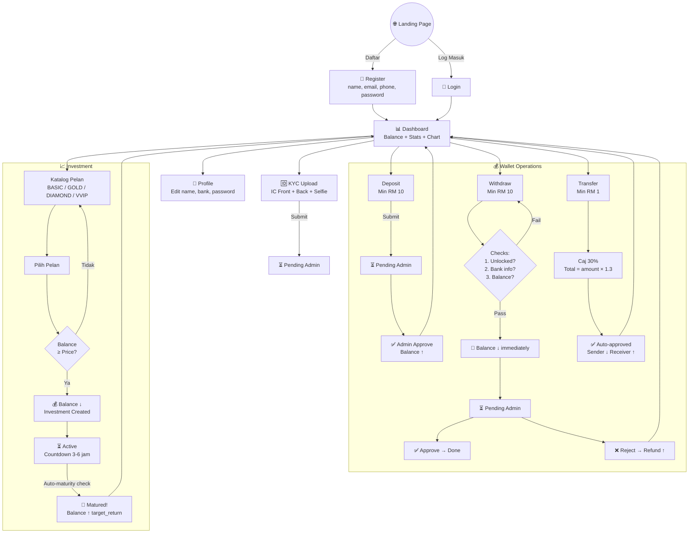
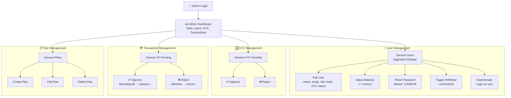
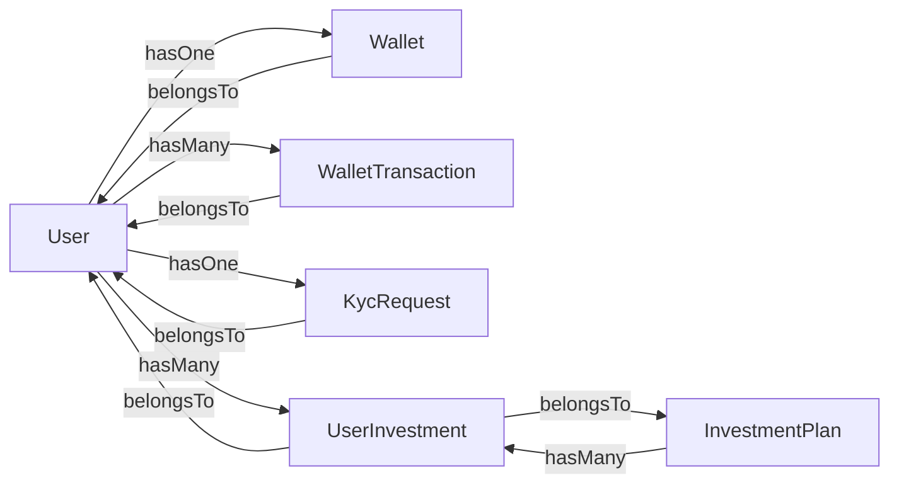
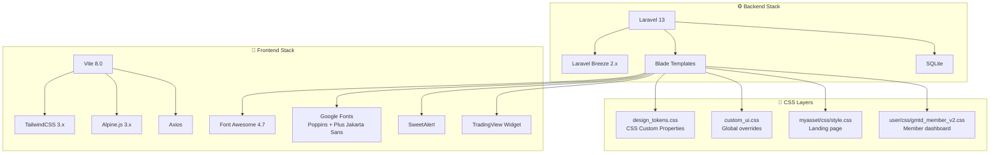

# 🏗️ DENAH PROJECT — KWSP Malaysia Investment Platform

> **Project Blueprint & Architecture Map**  
> Dokumen ini adalah peta lengkap struktur projek untuk rujukan agent pembinaan semula.

---

## 1. Peta Direktori Projek

```
KWSP/
├── app/
│   ├── Http/
│   │   ├── Controllers/
│   │   │   ├── Admin/
│   │   │   │   └── InvestmentPlanController.php    ← CRUD pelan pelaburan (admin)
│   │   │   ├── Auth/                               ← Laravel Breeze auth controllers
│   │   │   │   ├── AuthenticatedSessionController.php
│   │   │   │   ├── ConfirmablePasswordController.php
│   │   │   │   ├── EmailVerificationNotificationController.php
│   │   │   │   ├── EmailVerificationPromptController.php
│   │   │   │   ├── NewPasswordController.php
│   │   │   │   ├── PasswordController.php
│   │   │   │   ├── PasswordResetLinkController.php
│   │   │   │   ├── RegisteredUserController.php    ← Custom: tambah phone, country
│   │   │   │   └── VerifyEmailController.php
│   │   │   ├── Controller.php                      ← Base controller
│   │   │   ├── AdminController.php                 ← Admin: users, KYC, wallet, impersonate
│   │   │   ├── DashboardController.php             ← Dashboard + auto-maturity
│   │   │   ├── InvestmentController.php            ← Pelaburan user + auto-maturity
│   │   │   ├── KycController.php                   ← Upload KYC documents
│   │   │   ├── ProfileController.php               ← Edit profil user
│   │   │   └── WalletController.php                ← Deposit, Withdraw, Transfer
│   │   ├── Middleware/
│   │   │   └── IsAdmin.php                         ← Guard: role === 'admin'
│   │   └── Requests/
│   │       ├── Auth/                               ← Breeze request classes
│   │       └── ProfileUpdateRequest.php
│   ├── Models/
│   │   ├── User.php                                ← Relationships + maskedBankAccount accessor
│   │   ├── Wallet.php                              ← HasOne dari User
│   │   ├── WalletTransaction.php                   ← HasMany dari User
│   │   ├── InvestmentPlan.php                      ← HasMany UserInvestment
│   │   ├── UserInvestment.php                      ← BelongsTo User + InvestmentPlan
│   │   └── KycRequest.php                          ← HasOne dari User
│   ├── Providers/
│   ├── Traits/
│   │   └── AutoMaturity.php                        ← Auto-settle matured investments
│   └── View/
│       └── Components/                             ← Blade view components
│
├── database/
│   ├── migrations/
│   │   ├── 0001_01_01_000000_create_users_table.php
│   │   ├── 0001_01_01_000001_create_cache_table.php
│   │   ├── 0001_01_01_000002_create_jobs_table.php
│   │   ├── 2026_04_09_004052_create_wallets_table.php
│   │   ├── 2026_04_09_004053_create_wallet_transactions_table.php
│   │   ├── 2026_04_09_004054_create_kyc_requests_table.php
│   │   ├── 2026_04_09_004055_create_investment_plans_table.php
│   │   ├── 2026_04_09_004056_create_user_investments_table.php
│   │   ├── 2026_04_09_043800_add_withdraw_unlocked_to_users_table.php
│   │   └── 2026_04_12_073507_restructure_investment_plans_tables.php
│   ├── factories/
│   │   └── UserFactory.php
│   ├── seeders/
│   │   ├── DatabaseSeeder.php                      ← Admin account + sample plans
│   │   └── InvestmentPlanSeeder.php                ← 12 tiered investment plans
│   └── database.sqlite
│
├── resources/
│   ├── css/
│   │   └── app.css                                 ← Vite entry (TailwindCSS)
│   ├── js/
│   │   └── app.js                                  ← Vite entry (Alpine.js, Axios)
│   └── views/
│       ├── welcome.blade.php                       ← Landing page (standalone)
│       ├── dashboard.blade.php                     ← User dashboard (extends member)
│       ├── layouts/
│       │   ├── app.blade.php                       ← Admin layout (Breeze default)
│       │   ├── guest.blade.php                     ← Auth pages layout
│       │   ├── member.blade.php                    ← Member area layout (bottom nav)
│       │   └── navigation.blade.php                ← Top navigation (Breeze)
│       ├── auth/
│       │   ├── login.blade.php
│       │   ├── register.blade.php                  ← Custom: tambah phone, country, currency
│       │   ├── forgot-password.blade.php
│       │   ├── reset-password.blade.php
│       │   ├── verify-email.blade.php
│       │   └── confirm-password.blade.php
│       ├── user/
│       │   ├── investment.blade.php                ← Katalog pelan pelaburan
│       │   ├── investment_active.blade.php         ← Senarai pelaburan aktif
│       │   ├── kyc.blade.php                       ← Upload KYC form
│       │   └── wallet/
│       │       ├── deposit.blade.php               ← Form deposit
│       │       ├── withdraw.blade.php              ← Form withdraw
│       │       └── transfer.blade.php              ← Form transfer
│       ├── admin/
│       │   ├── dashboard.blade.php                 ← Admin stats overview
│       │   ├── users.blade.php                     ← User list table
│       │   ├── users_edit.blade.php                ← Edit user form
│       │   ├── kyc.blade.php                       ← KYC pending list
│       │   ├── wallet.blade.php                    ← Pending transactions
│       │   └── plans/
│       │       ├── index.blade.php                 ← Plan list
│       │       ├── create.blade.php                ← Create plan form
│       │       └── edit.blade.php                  ← Edit plan form
│       ├── profile/
│       │   ├── edit.blade.php
│       │   └── partials/
│       ├── components/                             ← Reusable Blade components
│       │   ├── application-logo.blade.php
│       │   ├── auth-session-status.blade.php
│       │   ├── danger-button.blade.php
│       │   ├── dropdown.blade.php
│       │   ├── dropdown-link.blade.php
│       │   ├── input-error.blade.php
│       │   ├── input-label.blade.php
│       │   ├── modal.blade.php
│       │   ├── nav-link.blade.php
│       │   ├── primary-button.blade.php
│       │   ├── responsive-nav-link.blade.php
│       │   ├── secondary-button.blade.php
│       │   └── text-input.blade.php
│       └── partials/
│           └── animated-bg.blade.php               ← Background animation
│
├── routes/
│   ├── web.php                                     ← All web routes
│   ├── auth.php                                    ← Auth routes (Breeze)
│   └── console.php                                 ← Artisan commands
│
├── public/
│   ├── css/
│   │   └── design_tokens.css                       ← CSS custom properties / variables
│   ├── custom_ui.css                               ← Global UI overrides
│   ├── myasset/
│   │   ├── css/style.css                           ← Landing page styles
│   │   ├── image/
│   │   │   ├── main_logo.png                       ← Logo KWSP EPF
│   │   │   └── pc_main.svg                         ← Hero illustration
│   │   └── js/
│   ├── user/
│   │   ├── css/
│   │   │   ├── gmtd_member_v2.css                  ← Member area styles
│   │   │   └── sweetalert.css
│   │   └── js/
│   │       └── sweetalert-dev.js
│   ├── assets/vendor_components/
│   │   └── font-awesome/                           ← FA icons (local copy)
│   ├── logintheme/                                 ← Auth theme assets
│   ├── build/                                      ← Vite compiled assets
│   ├── index.php                                   ← Laravel entry point
│   └── .htaccess
│
├── config/                                         ← Laravel configs (standard)
├── storage/                                        ← Logs, cache, uploaded files
├── tests/
├── composer.json
├── package.json
├── vite.config.js
├── tailwind.config.js
├── postcss.config.js
└── .env.example
```

---

## 2. Diagram Arsitektur

### 2.1 Arsitektur MVC



### 2.2 Entity Relationship Diagram (ERD)

```mermaid
erDiagram
    USERS ||--o| WALLETS : "hasOne"
    USERS ||--o{ WALLET_TRANSACTIONS : "hasMany"
    USERS ||--o| KYC_REQUESTS : "hasOne"
    USERS ||--o{ USER_INVESTMENTS : "hasMany"
    INVESTMENT_PLANS ||--o{ USER_INVESTMENTS : "hasMany"

    USERS {
        bigint id PK
        string name
        string email UK
        string password
        string phone
        string bank_name
        string bank_account
        string status_kyc
        boolean is_disabled
        boolean is_withdraw_unlocked
        string country_code
        string country_name
        string currency_code
        string currency_symbol
        string role
    }

    WALLETS {
        bigint id PK
        bigint user_id FK
        string currency
        decimal balance
    }

    WALLET_TRANSACTIONS {
        bigint id PK
        bigint user_id FK
        string currency
        string type
        string status
        decimal amount
        string note
        string idempotency_key UK
    }

    KYC_REQUESTS {
        bigint id PK
        bigint user_id FK_UK
        string id_front_path
        string id_back_path
        string selfie_path
        string status
        string note
    }

    INVESTMENT_PLANS {
        bigint id PK
        string tier
        string name
        string description
        decimal price
        decimal target_return
        integer duration_days
        boolean status
        integer sort_order
    }

    USER_INVESTMENTS {
        bigint id PK
        bigint user_id FK
        bigint plan_id FK
        string plan_name
        decimal amount
        decimal target_return
        integer duration_days
        datetime start_at
        datetime end_at
        string status
    }
```

---

## 3. Flow Pengguna (User Journey)

### 3.1 Aliran Utama Pengguna



### 3.2 Aliran Admin



---

## 4. Peta Route Lengkap

### 4.1 Public Routes

| Method | URI | Controller | Name | Middleware |
|--------|-----|-----------|------|-----------|
| GET | `/` | Closure | - | - |

### 4.2 Auth Routes (Guest)

| Method | URI | Controller | Name | Middleware |
|--------|-----|-----------|------|-----------|
| GET | `/register` | RegisteredUserController@create | `register` | `guest` |
| POST | `/register` | RegisteredUserController@store | - | `guest` |
| GET | `/login` | AuthenticatedSessionController@create | `login` | `guest` |
| POST | `/login` | AuthenticatedSessionController@store | - | `guest` |
| GET | `/forgot-password` | PasswordResetLinkController@create | `password.request` | `guest` |
| POST | `/forgot-password` | PasswordResetLinkController@store | `password.email` | `guest` |
| GET | `/reset-password/{token}` | NewPasswordController@create | `password.reset` | `guest` |
| POST | `/reset-password` | NewPasswordController@store | `password.store` | `guest` |

### 4.3 Auth Routes (Authenticated)

| Method | URI | Controller | Name | Middleware |
|--------|-----|-----------|------|-----------|
| GET | `/verify-email` | EmailVerificationPromptController | `verification.notice` | `auth` |
| GET | `/verify-email/{id}/{hash}` | VerifyEmailController | `verification.verify` | `auth, signed` |
| POST | `/email/verification-notification` | EmailVerificationNotificationController@store | `verification.send` | `auth` |
| GET | `/confirm-password` | ConfirmablePasswordController@show | `password.confirm` | `auth` |
| POST | `/confirm-password` | ConfirmablePasswordController@store | - | `auth` |
| PUT | `/password` | PasswordController@update | `password.update` | `auth` |
| POST | `/logout` | AuthenticatedSessionController@destroy | `logout` | `auth` |

### 4.4 Member Routes

| Method | URI | Controller | Name | Middleware |
|--------|-----|-----------|------|-----------|
| GET | `/dashboard` | DashboardController@index | `dashboard` | `auth, verified` |
| GET | `/profile` | ProfileController@edit | `profile.edit` | `auth` |
| PATCH | `/profile` | ProfileController@update | `profile.update` | `auth` |
| DELETE | `/profile` | ProfileController@destroy | `profile.destroy` | `auth` |
| GET | `/wallet/deposit` | WalletController@deposit | `wallet.deposit` | `auth` |
| POST | `/wallet/deposit` | WalletController@depositPost | `wallet.deposit.post` | `auth` |
| GET | `/wallet/withdraw` | WalletController@withdraw | `wallet.withdraw` | `auth` |
| POST | `/wallet/withdraw` | WalletController@withdrawPost | `wallet.withdraw.post` | `auth` |
| GET | `/wallet/transfer` | WalletController@transfer | `wallet.transfer` | `auth` |
| POST | `/wallet/transfer` | WalletController@transferPost | `wallet.transfer.post` | `auth` |
| GET | `/kyc` | KycController@index | `kyc.index` | `auth` |
| POST | `/kyc` | KycController@store | `kyc.store` | `auth` |
| GET | `/investment` | InvestmentController@index | `investment.index` | `auth` |
| POST | `/investment` | InvestmentController@invest | `investment.invest` | `auth` |

### 4.5 Admin Routes

| Method | URI | Controller | Name | Middleware |
|--------|-----|-----------|------|-----------|
| GET | `/admin` | AdminController@index | `admin.index` | `auth, is_admin` |
| GET | `/admin/users` | AdminController@users | `admin.users` | `auth, is_admin` |
| GET | `/admin/users/{id}/edit` | AdminController@editUser | `admin.users.edit` | `auth, is_admin` |
| POST | `/admin/users/{id}/update` | AdminController@updateUser | `admin.users.update` | `auth, is_admin` |
| POST | `/admin/users/{id}/balance` | AdminController@adjustBalance | `admin.users.balance` | `auth, is_admin` |
| POST | `/admin/users/{id}/reset-password` | AdminController@resetPassword | `admin.users.reset_password` | `auth, is_admin` |
| POST | `/admin/users/{id}/toggle-withdraw` | AdminController@toggleWithdraw | `admin.users.toggle_withdraw` | `auth, is_admin` |
| GET | `/admin/users/{id}/impersonate` | AdminController@impersonate | `admin.users.impersonate` | `auth, is_admin` |
| GET | `/admin/leave-impersonate` | AdminController@leaveImpersonate | `admin.leave_impersonate` | `auth, is_admin` |
| GET | `/admin/kyc` | AdminController@kyc | `admin.kyc` | `auth, is_admin` |
| POST | `/admin/kyc/{id}/approve` | AdminController@approveKyc | `admin.kyc.approve` | `auth, is_admin` |
| POST | `/admin/kyc/{id}/reject` | AdminController@rejectKyc | `admin.kyc.reject` | `auth, is_admin` |
| GET | `/admin/wallet` | AdminController@wallet | `admin.wallet` | `auth, is_admin` |
| POST | `/admin/wallet/{id}/approve` | AdminController@approveTx | `admin.wallet.approve` | `auth, is_admin` |
| POST | `/admin/wallet/{id}/reject` | AdminController@rejectTx | `admin.wallet.reject` | `auth, is_admin` |
| GET | `/admin/plans` | Admin\InvestmentPlanController@index | `admin.plans.index` | `auth, is_admin` |
| GET | `/admin/plans/create` | Admin\InvestmentPlanController@create | `admin.plans.create` | `auth, is_admin` |
| POST | `/admin/plans` | Admin\InvestmentPlanController@store | `admin.plans.store` | `auth, is_admin` |
| GET | `/admin/plans/{plan}/edit` | Admin\InvestmentPlanController@edit | `admin.plans.edit` | `auth, is_admin` |
| PUT | `/admin/plans/{plan}` | Admin\InvestmentPlanController@update | `admin.plans.update` | `auth, is_admin` |
| DELETE | `/admin/plans/{plan}` | Admin\InvestmentPlanController@destroy | `admin.plans.destroy` | `auth, is_admin` |

---

## 5. Model Relationships Map



### Model Fillable Fields

| Model | Fillable |
|-------|----------|
| **User** | `name, email, password, phone, bank_name, bank_account, status_kyc, is_disabled, is_withdraw_unlocked, role, country_code, country_name, currency_code, currency_symbol` |
| **Wallet** | `user_id, currency, balance` |
| **WalletTransaction** | `user_id, currency, type, status, amount, note, idempotency_key` |
| **KycRequest** | `user_id, id_front_path, id_back_path, selfie_path, status, note` |
| **InvestmentPlan** | `tier, name, description, price, target_return, duration_days, status, sort_order` |
| **UserInvestment** | `user_id, plan_id, plan_name, amount, target_return, duration_days, start_at, end_at, status` |

### User Model Casts

```php
'email_verified_at' => 'datetime',
'password' => 'hashed',
```

### Custom Accessors

- `User::getMaskedBankAccountAttribute()` — Mask bank account: `*******6789`

---

## 6. Dependency Graph Komponen



---

## 7. Senarai File & Tanggungjawab

### 7.1 Controllers (Business Logic)

| File | LOC | Tanggungjawab |
|------|-----|---------------|
| `DashboardController.php` | 40 | Dashboard stats, auto-create wallet, trigger maturity |
| `WalletController.php` | 185 | Deposit/Withdraw/Transfer + 30% fee logic + wallet locking |
| `InvestmentController.php` | 71 | Display plans, process investment, trigger maturity |
| `KycController.php` | 38 | Upload & store KYC documents |
| `ProfileController.php` | ~50 | Edit user profile (Breeze standard) |
| `AdminController.php` | 186 | Full admin panel: users, KYC, wallet, impersonate, balance adjust |
| `Admin/InvestmentPlanController.php` | 84 | CRUD investment plans |
| `Auth/RegisteredUserController.php` | 58 | Custom registration (phone, country fields) |

### 7.2 Models (Data Layer)

| File | LOC | Relationships |
|------|-----|---------------|
| `User.php` | 65 | hasOne Wallet, hasMany WalletTransaction, hasOne KycRequest, hasMany UserInvestment |
| `Wallet.php` | 16 | belongsTo User |
| `WalletTransaction.php` | 16 | belongsTo User |
| `InvestmentPlan.php` | 16 | hasMany UserInvestment |
| `UserInvestment.php` | 21 | belongsTo User, belongsTo InvestmentPlan |
| `KycRequest.php` | 16 | belongsTo User |

### 7.3 Views (UI Layer)

| Kategori | Files | Layout |
|----------|-------|--------|
| Landing | `welcome.blade.php` | Standalone |
| Dashboard | `dashboard.blade.php` | `layouts/member` |
| Auth | 6 files (`login`, `register`, etc.) | `layouts/guest` |
| User Wallet | 3 files (`deposit`, `withdraw`, `transfer`) | `layouts/member` |
| User Feature | 3 files (`investment`, `investment_active`, `kyc`) | `layouts/member` |
| Admin | 5 files + 3 plan files | `layouts/app` |
| Profile | 2 files | `layouts/app` |
| Components | 13 Blade components | N/A |
| Layouts | 4 layout files | N/A |
| Partials | 1 file (`animated-bg`) | N/A |

### 7.4 Migrations (Schema)

| Order | File | Tables |
|-------|------|--------|
| 1 | `create_users_table` | `users`, `password_reset_tokens`, `sessions` |
| 2 | `create_cache_table` | `cache`, `cache_locks` |
| 3 | `create_jobs_table` | `jobs`, `job_batches`, `failed_jobs` |
| 4 | `create_wallets_table` | `wallets` |
| 5 | `create_wallet_transactions_table` | `wallet_transactions` |
| 6 | `create_kyc_requests_table` | `kyc_requests` |
| 7 | `create_investment_plans_table` | `investment_plans` |
| 8 | `create_user_investments_table` | `user_investments` |
| 9 | `add_withdraw_unlocked_to_users_table` | Alter `users` |
| 10 | `restructure_investment_plans_tables` | Alter `investment_plans` + `user_investments` |

---

## 8. Nota Pembinaan Semula

> [!IMPORTANT]
> **Langkah-langkah untuk membina semula projek ini dari kosong:**
> 1. `laravel new KWSP` (Laravel 13)
> 2. `composer require laravel/breeze --dev` → `php artisan breeze:install blade`
> 3. Custom register form (tambah phone, country)
> 4. Buat semua 6 migrations custom
> 5. Buat 6 Models dengan relationships
> 6. Buat `AutoMaturity` Trait
> 7. Buat `IsAdmin` Middleware + register
> 8. Buat semua Controllers (7 custom)
> 9. Buat routes di `web.php`
> 10. Buat semua Blade views (landing, member, admin)
> 11. Setup CSS design system (design_tokens.css, custom_ui.css, gmtd_member_v2.css)
> 12. Setup static assets (logo, hero image)
> 13. Buat seeders (admin + investment plans)
> 14. Run migrations + seed

> [!WARNING]
> **Static Assets:** Projek ini bergantung pada beberapa fail CSS dan imej statik yang perlu dicipta atau direplika. Fail utama:
> - `public/css/design_tokens.css` — CSS custom properties
> - `public/custom_ui.css` — UI overrides
> - `public/myasset/css/style.css` — Landing page
> - `public/user/css/gmtd_member_v2.css` — Member dashboard
> - `public/myasset/image/main_logo.png` — Logo
> - `public/myasset/image/pc_main.svg` — Hero illustration

> [!TIP]
> **Dev Server:** Gunakan `composer dev` untuk menjalankan `php artisan serve`, `queue:listen`, `pail`, dan `npm run dev` secara serentak menggunakan `concurrently`.
